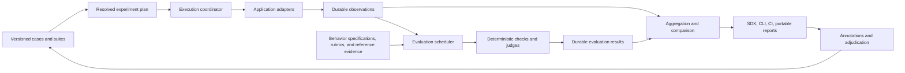

# Alignmenter Next: target state

Status: planning draft, 2026-09-06. No implementation is implied by this document.
Repository baseline: `4366f72`; 132 Python tests and Ruff passed during the inspection.

The user has agreed to address the execution, scoring, reporting, and extensibility
findings and requested a substantial upgrade. Subsequent direction is incorporated:
usefulness to Atlas and potentially AverCare is the bar; retain the alignment focus;
prioritize SDK, CLI, and CI; accept justified compatibility breaks; meet current
evaluation practice. AverCare's repository and first evaluation target are pending discovery.

The companion [delivery plan](alignmenter-next-delivery.md) defines milestones,
dependencies, acceptance tests, migration, and the first implementation slices.
The [Atlas acceptance design](alignmenter-next-atlas.md) adds a concrete behavior spec,
18 draft cases, preserved observed failures, and a worked comparison. The
[executor decision protocol](alignmenter-next-executor.md) defines the bounded backend spike.
The completed [spike decision](alignmenter-next-executor-decision.md) selects evolving
Alignmenter's execution path with authoritative SQLite records for the first release.
The [first production capture slice](../guides/durable-runs.md) is now implemented behind
the existing runner, followed by [safe capture-only resume](../guides/capture-recovery.md)
for recorded and explicitly compatible stateless targets. A third slice adds
[durable rubric evaluations](../guides/durable-evaluations.md), shared judge reservations,
and pure saved-result summaries. A fourth slice adds [durable grounding and faithfulness](../guides/grounding-faithfulness.md)
with typed assessments, deterministic traceability, strict claim judgments, and pure metrics.
The broader target state below remains the delivery plan.

## 1. Product purpose

Alignmenter tests whether an AI application behaves according to its intended role,
the user's situation, and the product's explicit commitments. It helps a team establish
whether a change improves that behavior, explain regressions, and preserve what it
learns as repeatable tests. Atlas is the first acceptance case; AverCare is the proposed
second consumer. Generality follows from their needs and reusable contracts.

The object being evaluated is the actual application through an adapter, including its
retrieval, conversation state, and relevant tool actions. Isolated model evaluation and
structured-output checks are supported where they help diagnose the application.

The main workflow is:

1. Define cases and the behavior that matters.
2. Capture or generate application outputs and their evidence.
3. Evaluate with deterministic checks, reviewed rubrics, and optional judges.
4. Inspect failures, missing evidence, execution errors, and evaluator disagreements.
5. Compare a candidate with a baseline on equivalent cases and evaluation versions.
6. Review important findings and promote them into a versioned regression suite.
7. Run the suite locally or in CI with explicit release criteria.

An attractive report is useful when the underlying result can be traced to a case,
an execution, the evidence available to the evaluator, and a versioned evaluation rule.

## 2. Scope and product decisions

| Decision | Proposed direction | Status |
| --- | --- | --- |
| Breadth | Alignment and practical behavior of Atlas and potentially AverCare; reuse demonstrated common needs | Confirmed direction |
| Primary interfaces | Python SDK, CLI, and straightforward CI hooks; portable reports and review exports | Confirmed direction |
| Compatibility | Justified API/config breaks are acceptable; preserve valuable data and explain semantic migrations | Confirmed direction |
| Runtime | Local execution, local storage, optional remote target and judge providers | Proposed |
| Deployment | Installable toolkit with no required server; browser workspace is an optional later extension | Proposed implementation |
| Persistence | SQLite for transactional records; content-addressed files for large artifacts; portable exports | Backend selected by spike; production schema/artifact details pending |
| First reference applications | Atlas, then one verified AverCare workflow; retain persona fixtures for continuity | Confirmed priority; AverCare target open |
| Additional reference | A tiny structured/tool fixture only where needed to validate the shared contract | Bounded engineering fixture |
| Quality policy | Explicit coverage, applicability, and gate outcomes; no implicit overall grade | Proposed |
| Release name | Use “Next” during design; choose the version after compatibility work is scoped | Open |

The complete upgrade includes behavioral specifications, scenario-based alignment
evaluation, durable execution, versioned judgments, comparisons, bounded experiments,
human review, evaluator calibration, and CI gates. Structured tool-trace evaluation
ships to the extent Atlas or the selected AverCare workflow needs it. Artifact references
permit later image/audio support without promising multimodal judges in this release.

Hosted collaboration, a full browser review application, distributed worker clusters,
production traffic collection, model serving, and autonomous prompt optimization remain extension directions.
They require separate product decisions and do not block this upgrade's usefulness.
Dataset generation and suggested fixes produce drafts for review; a generated case
does not become a reference answer merely because a model supplied its label.

### The alignment focus

A versioned `BehaviorSpec` combines the product's role, intended user outcomes,
evidence obligations, action permissions, boundaries, communication style, and rules
for changing behavior with context. Persona is one component. The specification also
declares how to resolve conflicts between obligations and preferences.

Evaluate alignment at three levels:

- **Task:** does the response help with the actual problem under the stated constraints?
- **Relationship and role:** does it behave like the intended assistant, preserve relevant
  facts/preferences, acknowledge uncertainty, and respect its declared scope?
- **Trajectory:** do those commitments hold across follow-ups, changed circumstances,
  conflicting instructions, and pressure to abandon the product's boundaries?

The positive obligations matter. A system that avoids mistakes by refusing everything
or reciting generic caveats fails the usefulness criteria. A system that sounds fluent
and agreeable while violating its evidence or action boundaries fails those criteria.
The product team defines these tradeoffs in reviewable rules, rather than hiding them
in an unvalidated weighted average.

Scenario families test both invariance and appropriate change. Rephrasing a question
should preserve the relevant commitments; removing fuel from an Atlas scenario should
change which procedures count as feasible. An actual change in circumstances can require
a different answer without being classified as persona drift.

### Current-practice check, researched 2026-09-06

This is a focused capability check from official documentation, not an exhaustive market
survey. It establishes a baseline and does not claim Alignmenter's planned features are unique.

| Capability documented elsewhere | Evidence | Consequence for this upgrade |
| --- | --- | --- |
| Interrupted evaluation retry with completed-sample reuse | [Inspect logs and retries](https://inspect.aisi.org.uk/eval-logs.html) | Durable execution and stable IDs belong in the baseline |
| Immutable experiments usable through SDK and CI | [Braintrust experiments](https://www.braintrust.dev/docs/evaluate/run-evaluations) | Saved comparisons and code-defined suites are expected workflows |
| Comparative evaluation of existing experiments | [LangSmith pairwise evaluation](https://docs.langchain.com/langsmith/evaluate-pairwise) | Evaluate saved outputs under common criteria, with explicit comparison work |
| Judge iteration against human feedback | [LangSmith evaluator alignment](https://docs.langchain.com/langsmith/improve-judge-evaluator-feedback) | Judge qualification and reviewed expectations must ship with the alignment story |
| JSON/HTML/JUnit output and CI quality gates | [Promptfoo CI integration](https://www.promptfoo.dev/docs/integrations/ci-cd/) | Supply standard CI artifacts and noninteractive behavior |

Own the behavioral specification, scenario tests, evidence semantics, and application
integrations. Reuse provider SDKs, typed validation, statistical libraries, and suitable
existing execution mechanisms. The completed M0 build-versus-compose spike selected a
small native coordinator: both tested options passed with shared guards, while Inspect
did not eliminate the application-specific durability and accounting layer. See the
[decision and scope limits](alignmenter-next-executor-decision.md).
Judge that choice by a working acceptance fixture, dependency cost, and semantic control.

Provider modernization is capability-based: current application/model/judge endpoints,
structured output, tool events, usage, cancellation, and explicit unsupported features.
Audit actual endpoint support during implementation against primary provider docs; do
not carry obsolete integrations or model identifiers forward solely for compatibility.

## 3. Observable target-state workflows

### A. Improve Atlas with evidence

An engineer imports the saved Atlas transcripts and creates a reviewed suite of
canonical, constrained, adaptive, follow-up, and missing-evidence cases. They inspect
the winter-homestead failure with the question, retrieved passages, answer, and
criterion-level judgments visible together.

They run the actual iPhone application against two prompt configurations. The phone
disconnects at case 18. Completed answers and evaluations remain readable, the failed
attempt has a reason, and the run resumes without discarding completed work. A stale
device response cannot satisfy a new attempt just because the question text matches.

The comparison shows task success, factual support, citation support, execution
completion, sustained latency, and thermal conditions. A new prompt that removes
numbers but continues missing the task does not appear improved on task success.
The engineer reviews a regression and adds it to the next dataset revision.

### B. Apply it to one AverCare workflow

The initial workflow must be selected from the actual repository. Candidate evaluation
concerns include fidelity to supplied health context, the product's intended assistance
role, continuity across turns, changed user circumstances, appropriate uncertainty, and
permitted actions. These are candidates, not claims about AverCare's current features.

Begin with synthetic or already-approved fixtures and application-owned expectations.
Route the actual service/agent output and observed context through an adapter. Reuse
existing traces and tests where possible; neither deploying a new observability system
nor sending patient records to an external judge is required for adoption.

Success is a runnable suite in AverCare's existing test/CI workflow that detects a
reviewed behavior regression. Product and domain reviewers own the accepted behavior;
Alignmenter tracks the evidence and whether its evaluators agree with those reviewers.

### C. Maintain a conversational persona

A team loads its existing persona and conversations. It evaluates voice, appropriate
behavior for each scenario, and conversation-level requirements. It can inspect how
the judge and deterministic components differ instead of accepting an unexplained blend.

Calibration uses declared train, development, and test groups. Related turns and
derived examples stay in the same split. The learned artifact records exactly which
examples and fitting procedure produced it. Comparing two artifacts uses held-out
labels with a suitable uncertainty estimate.

### D. Test a bounded workflow, where the applications require one

A support-workflow fixture must find a record, update the correct field, and produce
a receipt. A target adapter returns the final output, tool events, and observed final
state. Evaluators check the outcome and required constraints directly. Persona
configuration, retrieval excerpts, and an LLM judge are optional.

This exercises application evaluation without requiring Alignmenter to implement an
agent runtime. The target owns application execution and its sandbox/test fixtures.

### E. Make a release decision in CI

CI imports an approved baseline and runs a declared regression suite. Gates combine
hard constraints, quality thresholds, completion requirements, and permitted paired
regressions. Missing required evidence or unavailable judging is inconclusive and
cannot produce a green release result. Reports and machine-readable gate results agree.

### F. Evaluate the evaluator

A reviewer compares a new judge, rubric, or deterministic scorer with a fixed set of
human-adjudicated cases. The report lists false passes, false failures, agreement by
criterion and scenario, coverage, repeated-judgment variation, and cost. A new evaluator
version can then rescore saved outputs without running the application again.

## 4. Non-negotiable semantics

1. Completed observations and completed evaluations are committed as work progresses.
2. Execution failure, evaluator failure, skipped work, and product failure are distinct.
3. Unknown results never become zero violations or perfect scores by default.
4. Each evaluation result has a stable identity and versioned inputs.
5. Reports, slices, and ordinary comparisons aggregate saved results without provider calls.
6. Required release gates include coverage and evidence requirements.
7. A hard failure cannot be hidden by averaging unrelated dimensions.
8. Original observations remain immutable; review and rescoring create linked revisions.
9. Generation inputs exclude reference answers, private rubric expectations, and review labels.
10. Application observations and evaluator reference material have separate provenance.
11. Budgets apply across the entire declared run/experiment scope and survive resume.
12. Reproducibility means identifying and replaying recorded inputs and results; it does
    not promise deterministic output from nondeterministic remote models or devices.

## 5. Architecture



The coordinator owns execution state, resource leases, attempts, deadlines, and budgets.
Application adapters own the mechanics of calling the actual target. Evaluators own
the meaning of their measurements. Aggregation is a pure operation over a declared
snapshot of observations and evaluation results. Any future review UI is a client of
the same query and command interfaces used by the CLI.

Use a bounded dependency graph for generation, evaluation, and explicitly configured
judge escalation. This is an internal execution mechanism; users should be able to
configure ordinary evaluations without learning a workflow orchestration language.

### Core domain objects

| Object | Contents and role |
| --- | --- |
| `Case` | Stable logical ID, revision/content digest, typed input, tags, split group, expectations, reference artifact links |
| `BehaviorSpec` | Versioned role, goals, positive obligations, boundaries, preferences, contextual rules, and precedence |
| `ScenarioFamily` | Related cases with controlled changes; expected invariant commitments and expected behavior changes |
| `Suite` | Frozen case membership, selection rules, evaluator configuration, applicability rules, gates |
| `TargetSpec` | Adapter, declared capabilities, nonsecret application/model/config revision, execution parameters |
| `ExperimentSpec` | Target variants, repeats, seed policy, case selection, resource policy, evaluation snapshot |
| `RunManifest` | Resolved configuration and content digests, package versions, target identity, dataset/evaluator versions, environment facts |
| `Attempt` | Unique invocation ID, parent execution, lease, deadline, status, timestamps, failure classification |
| `Observation` | Actual output, observed inputs/context, tool events, final state, artifacts, usage and timing, provenance completeness |
| `EvaluatorSpec` | Version, behavior/criterion dependencies, accepted input schema, scope, required evidence, metric descriptors, configuration |
| `EvaluationResult` | Case/session and observation IDs, evaluator digest, metric results, evidence references, judgment artifacts, status |
| `MetricDescriptor` | Name, type/unit, direction, scope, applicability, aggregation, denominator, uncertainty method |
| `Annotation` | Reviewer, criterion, value, rationale, evidence, observation/rubric revision, timestamp; immutable history |
| `Comparison` | Two observation sets, shared evaluation snapshot, matched cases/repeats, exclusions, deltas, coverage and uncertainty |
| `GateResult` | Policy version, pass/warn/fail/inconclusive, evidence and denominator, offending case links |
| `Artifact` | Content digest, media type, length, origin, storage reference, export policy |

Typed, versioned schemas are public contracts. Unknown fields, duplicate IDs, invalid
metric values, unknown gates, and unresolved plugin names fail validation before costly
work starts. Schema migration is explicit and tested.

### Result statuses and coverage

Execution statuses are `pending`, `running`, `succeeded`, `failed`, `cancelled`,
`interrupted`, and `unknown_outcome`. A timeout is a classified failure or unknown
outcome depending on whether the adapter can confirm that execution stopped.

Evaluation statuses are `scored`, `not_applicable`, `missing_evidence`, `invalid_result`,
`skipped_budget`, `blocked`, and `error`. A recorded abstention is application behavior
that can be scored; it is not an evaluator error or automatic success.

Every aggregate carries planned, eligible, scored, missing, skipped, and failed counts.
Suites declare eligibility from case types and required capabilities before observing
the outcome. A failure cannot be reclassified as not applicable to improve coverage.

Keep at least these views separate:

- Application completion: completed eligible executions / planned eligible executions.
- Evaluation coverage: valid evaluations / planned eligible evaluation units.
- Conditional quality: quality among valid evaluated outputs, with that denominator visible.
- End-to-end task success: successful cases / planned eligible cases when the task
  definition explicitly counts execution failures as unsuccessful tasks.

An empty population has no empirical score. An incomplete required evaluation produces
an inconclusive gate. Known hard failures still produce failure even if another dimension
is incomplete. The display presents both findings without overwriting either.

## 6. Durable execution and application adapters

Create the run and frozen manifest before the first external call. Commit each attempt
transition, observation, and evaluator result transactionally. A process killed after an
answer completes can only lose work not yet committed; recovery reports that boundary.

The selected direction uses one coordinator writer with transactional state and an
event history. Workers return structured results. Authoritative records live in SQLite
and large immutable payloads in a content-addressed artifact directory. Production
implementation must define the database/artifact commit boundary and preserve the
accepted commit, recovery, and export guarantees.
JSONL and JSON exports are snapshots, not a second competing live source of truth.

An export uses a consistent database snapshot plus a verified artifact manifest. It
opens and renders on another machine without application adapters, model dependencies,
API credentials, or network access. Import validates schema, hashes, paths, and sizes.

### Attempts, retries, and recovery

- Retry only classified transient errors, with bounded attempts, backoff, and an overall deadline.
- Record every attempt and its cost, including failed or malformed judge responses.
- Use unique request IDs and fencing tokens; quarantine late results from expired attempts.
- An adapter declares idempotency, cancellation, reset, concurrency, and recovery capabilities.
- A remote or tool action with uncertain completion becomes `unknown_outcome`. Recovery
  reconciles it or starts a deliberately new execution; there is no promise of exactly-once
  external execution when the target cannot provide it.
- A cooperative timeout must actually cancel the worker where supported. Sync adapters
  requiring hard deadlines run in managed processes; an abandoned thread is not cancellation.
- Cancellation stops new work, requests cancellation of active attempts, commits state,
  and leaves completed observations available for reporting and later resume.
- Resume checks the manifest and execution identity. Changed configurations create a new
  run or evaluation revision rather than modifying the meaning of existing results.

### State and scheduling

Independent cases may run concurrently. Turns within a stateful session preserve order.
An adapter that cannot restore state resumes at a safe session boundary, retaining the
previous attempt history and identifying any repeated application calls.

Shared resources have leases: one physical phone permits one active application run,
while independent judge work can proceed elsewhere. Rate limits, concurrency limits,
per-case deadlines, run deadlines, and generation/judging budgets are separate policies.

For hardware experiments record cold/warm state, thermal state, sampling order, and
wall-clock timestamps. Offer declared cooldown/block-order policies and record departures
from them. Compare sustained behavior independently from single-question warm performance.

### Atlas integration requirements

The device hook and adapter need request/response IDs, explicit session reset, health
and cancellation/recovery behavior, and response provenance. Errors must echo the
request identity. The current question-string freshness check is insufficient for repeats.
The adapter must expose the conversation actually consumed by Atlas, not merely accept
a `messages` argument while forwarding only its final question.

Changes to this adapter and smoke hook belong in Atlas. Alignmenter supplies the general
adapter contract, resource scheduling, and result persistence. Imported old transcripts
retain an “observed context completeness unknown” designation where appropriate.

## 7. Evaluation system and metric packs

An evaluator consumes a frozen case/session, observation(s), and its explicitly allowed
reference data. It returns typed metric results and evidence. Its scope is declared as
turn, session, case, pair, or set. Set-level evaluators declare their dependency set and
cannot be silently treated as per-turn measurements.

Separate evaluation from aggregation. A metric pack registers descriptors and aggregate
functions so the CLI, UI, thresholds, and exports need no lists of built-in metric names.
Support pure Python plugins and installed entry points with validated configuration.
Plugins execute trusted installed code; importing a report never loads or executes plugins.

| Pack | Measures | Necessary distinctions |
| --- | --- | --- |
| Execution | Completion, latency, tokens, cost, resource observations | End-to-end vs generation timing; measured vs estimated vs unknown usage |
| Structured output | Schema conformance, exact/set matching, deterministic invariants | Invalid output vs missing execution; explicit tolerances |
| Retrieval | Relevant evidence recall/rank, context relevance, source coverage | Needs reviewed relevance labels; relevance is not merely embedding similarity |
| Grounding | Quantity consistency, citation resolution, claim support | Source presence, claim support, and correctness are different measurements |
| Task quality | Constraint satisfaction, required steps/outcomes, relevance, completeness, useful abstention | Reviewed criterion-level expectations; no implicit credit for verbosity |
| Behavioral alignment | Role fidelity, positive obligations, boundaries, contextual adaptation, resistance to inappropriate pressure | Product-owned specification; both excessive abstention and overreach can fail |
| Persona | Voice, lexical constraints, contextual appropriateness, calibrated traits | Deterministic and judge components visible; versioned blending only when validated |
| Conversation | Instruction retention, contradiction, state continuity, follow-up handling | Legitimate topic change is not automatically drift |
| Tool workflow | Required/forbidden actions, argument correctness, final state, task completion | Event traces and fixture truth; target supplies execution |
| Policy | Product-specific unacceptable outcomes and hard constraints | Validated evidence, coverage, severity; no universal safety certification |

Ship execution, repaired grounding, behavior/task rubrics, conversation cases, and
persona continuity first. Add structured output, retrieval labels, and tool-workflow
checks where Atlas or the selected AverCare workflow benefits. Make metric availability
explicit for each suite; generic breadth is not a release acceptance criterion.

### Repair and validate current metrics

Quantity extraction preserves signs, units, temperature scales, ranges, comparators,
ratios, and decimal conventions. Conversions require explicit supported arithmetic;
ambiguous parsing is reported. Quantities supplied in the question retain their source
identity. Unit-bearing presence alone remains a diagnostic proxy and is named accordingly.

Citation checks distinguish “reference resolves” from “the cited passage supports this
claim.” Unknown or incomplete context cannot establish unsupportedness with full confidence.

Retire the existing distance-variance stability headline from default suites. Keep a
versioned legacy diagnostic for old reports; introduce conversation invariants and
repeat consistency with independently validated semantics.

Persona component scores remain inspectable. Any blend declares weights, unit of
analysis, coverage, and validation. Its uncertainty estimate describes the actual blended
quantity, not the deterministic component's interval attached to a different headline.

## 8. Rubrics, references, and judge reliability

A behavior specification is translated into rubrics and scenario families with explicit
links back to each commitment. A rubric defines named criteria, anchored outcomes, applicability, required evidence,
allowed abstention, and severity. A case may add specific constraints, expected facts,
acceptable alternatives, disallowed actions, and independently sourced reference evidence.
Reference answers can be useful examples; wording overlap is not the default correctness test.

Separate two judgments:

- Faithfulness: is a claim supported by the evidence the application actually used?
- Correctness/task quality: does it satisfy the case's reviewed expectations and constraints?

Judges may supply useful diagnostics without reference labels, but their basis is recorded
as judge knowledge/heuristic rather than validated reference truth. Initial Atlas labels
must be reviewed; the existing generated answers are observations, not gold answers.

### Judge execution contract

1. Version the rubric, prompt, schema, model identifier, generation parameters, and evidence selection.
2. Treat application text, references, and tool output as untrusted evaluation data.
   Use delimited fields and test evaluator resistance to instructions embedded in that data.
3. Validate required fields, finite ranges, enum values, true booleans, and evidence links.
   `{}`, string booleans, dropped invalid claims, and partial output are invalid results.
4. Retain the raw request/response and structured verdict. A repair attempt is separately
   recorded, budgeted, and bounded; invalid results are never made successful by defaults.
5. Preserve source identity and coverage. Do not silently cut every source at 1,200 characters
   and represent the resulting prompt as all the evidence the application saw.
6. Use explicit chunked evaluation or declared evidence selection when context is large.
   Missing necessary evidence yields an incomplete evaluation; it is not proof of an unsupported claim.
7. Explain verdicts with criterion-level reasons and evidence references. Verify that quoted
   evidence exists, while keeping the semantic support judgment distinct from string matching.

### Budgets and caching

One ledger accounts for all target and judge calls in the declared scope, including
multiple evaluators, variants, retries, repairs, and escalation. Local per-stage limits
can restrict that ledger further. A run can resume without resetting spend or call counts.

Reserve projected cost/call capacity before dispatch; reconcile actual usage afterward.
Separate actual, estimated, unknown, reserved, and cached costs. A strict spend cap
requires an enforceable upper bound on request/output cost; otherwise report it as a
soft budget with bounded scheduling, not a guaranteed bill ceiling. Record pricing
configuration and version rather than silently guessing prices.

Persistent evaluation cache keys include the full observation, case expectations,
evaluator version/config, prompt/schema, evidence selection, and judge parameters.
Reused judgments are labeled. An explicit repeat asks for a new judgment and gets a
new sample identity instead of being accidentally deduplicated by the cache.

Optional escalation can request a stronger judge or human review for defined ambiguity,
disagreement, or high-impact criteria. Save the trigger and every opinion. Ensemble
majority is an aggregation policy to validate, not an automatic source of truth.

## 9. Comparison, experiments, and statistical meaning

Make comparing saved runs a normal operation. Generation, evaluation, and comparison
are independently invocable. Updating an evaluator creates new evaluations over the
same observations; both old and new results remain addressable.

Match by logical case ID, case revision, and repeat identity. Show added/removed cases,
unmatched revisions, changed eligibility, and unequal coverage. Comparisons intended
for release decisions require a common evaluation snapshot. If it changed, rescore both
observation sets under the chosen version before drawing a headline quality comparison.

An experiment matrix declares variants of application parameters, model, retrieval,
prompt, and corpus. It supports repeat counts, stable ordering/seeds, resource limits,
and budgets. Output caching never collapses intentional repetitions. Use frozen-context
experiments to distinguish retrieval changes from generation changes when the adapter
can support that intervention; a diagnostic label alone does not establish causality.

Provide:

- Per-case and per-criterion regressions, improvements, ties, and changed evidence.
- Paired quality deltas and separately reported completion differences.
- Scenario slices with visible counts and overlapping-tag semantics.
- Latency distributions and quality/cost/latency tradeoff plots.
- Session/group bootstrap intervals where observations share context or provenance.
- Repeat variation and judge variation, separate from uncertainty across sampled cases.
- Optional blinded pairwise judging with balanced presentation order, ties, and abstentions.

Document the statistic, sampling unit, seed, denominator, weighting, and minimum sample
requirements. Tiny samples produce descriptive results rather than spurious precision.
Do not attach population estimates to error-mined samples. Random/stratified audit samples
and diagnostic selection have separate identities; record inclusion probabilities when
weighted population estimates are supported. Explicitly distinguish exploratory slices
from predeclared release metrics and avoid “winner” claims across uncorrected large sweeps.

## 10. Human review and dataset improvement

The CLI and portable report make a case the primary inspection unit. Show the input,
constraints, observed output, source passages, tool events, criterion results, judge
evidence, and execution status. A comparison shows corresponding cases together.
Review exports must be easy for a non-engineer to label in existing tools. A complete
custom browser workspace is conditional on friction observed with Atlas or AverCare.

Review queues can select regressions, hard failures, low coverage, evaluator disagreement,
or a reproducible audit sample. Users can filter by scenario, target, criterion, evaluator,
status, and review state. Large suites use indexed queries and pagination.

Annotations attach to an observation and rubric revision. They record reviewer identity,
labels, rationale, and evidence. Multiple opinions remain visible; adjudication creates
a distinct decision. Machine judgments remain unchanged. Updated rubrics flag old labels
for revalidation instead of treating them as current automatically.

Promoting a failure to a regression case requires an explicit dataset edit with a stable
case ID, reviewed expectations, origin, split group, and version change. Generated
variations and imported incidents enter a candidate queue. Exact/near-duplicate checks
and source groups help avoid filling a suite with correlated copies.

CSV/JSONL annotation imports/exports and existing Label Studio workflows remain
supported. A future local UI or team service can use the same contracts without changing
evaluation semantics. Adjudication and review provenance are core; hosting them is optional.

## 11. Calibration and evaluating the evaluators

Generalize calibration around versioned examples and artifacts while retaining persona
tools. Support explicit train/development/test partitions and grouped cross-validation.
Fitting includes every learned bound, weight, threshold, vocabulary, and trait model.
Validation must know which examples influenced every fitted component.

The existing calibration validator splits rows after loading an already-fitted artifact;
that split cannot by itself establish held-out performance. The case-study cross-validation
script is useful prior work, but the general tool must track all learned inputs and
related-example groups, not only refit one component on individual rows.

Reports distinguish training fit, development tuning, held-out testing, and human agreement.
Synthetic labels, model labels, individual human labels, and adjudicated references remain
different provenance classes. A judge's confidence statement is not calibrated probability.

A scorer qualification suite includes known good/bad cases and controlled mutations:
changed units/signs, swapped citations, missing evidence, irrelevant but fluent answers,
constraint violations, harmless topic changes, empty verdicts, and injected instructions.
Qualification records false passes and false failures by criterion and scenario.

Calibration outputs are immutable, self-contained artifacts with training IDs/digests,
split policy, fitting code/version, hyperparameters, validation results, and limitations.
Automate the current manual bounds/weights/traits merge and verify artifact compatibility.

## 12. Interfaces and examples

The commands below describe the proposed interface, not commands available today.

```text
alignmenter init --template aligned-reference
alignmenter dataset validate cases.jsonl
alignmenter behavior validate behavior/atlas.yaml
alignmenter run --suite atlas.yaml
alignmenter resume <run-id>
alignmenter status <run-id>
alignmenter cancel <run-id>
alignmenter evaluate <run-id> --suite revised-rubric.yaml
alignmenter compare <baseline-id> <candidate-id> --policy release.yaml
alignmenter experiment run prompt-study.yaml
alignmenter review <run-or-comparison-id>
alignmenter report <run-or-comparison-id> --export ./review-bundle
alignmenter dataset promote <review-id> --to regressions.jsonl
alignmenter judge validate --labels reviewed.jsonl --evaluator task-quality.yaml
alignmenter calibrate fit --recipe persona-calibration.yaml
alignmenter migrate --from legacy-run --input reports/old-run
```

The SDK exposes the same domain contracts and operations, with progress/event callbacks
and sync convenience methods over the execution layer. A custom HTTP or callable target
and custom metric should not require editing the CLI, report renderer, or core registry.
`review` initially supports terminal inspection and export/import of labels. It does not
imply a browser server. HTTP, subprocess/JSONL, and recorded-artifact hooks let applications
in other languages integrate without embedding a Python runtime in their shipped product.
A native second-language SDK needs demonstrated value from the AverCare integration.

Illustrative behavior specification, separate from the implementation prompt:

```yaml
schema_version: 1
id: atlas-reference-behavior
revision: 1
role: Help a person use the offline library to solve practical problems.
commitments:
  - id: evidence_integrity
    criterion: Preserve the meaning and units of source claims; identify missing evidence.
    severity: blocking
  - id: respect_constraints
    criterion: Account for the resources and conditions in the question.
    severity: blocking
  - id: useful_adaptation
    criterion: Provide a workable next step or the specific missing information needed.
    severity: graded
  - id: explanatory_voice
    criterion: Explain relevant principles clearly and make procedures easy to follow.
    severity: graded
conflicts:
  - evidence_integrity takes precedence over providing a precise but unsupported figure.
  - Style preferences may yield to the case's practical urgency and user needs.
```

The specification states intended behavior. The product may implement it through any
prompt, model, retrieval policy, or code. A change in wording should not require rewriting
the expected outcomes unless the product's commitments actually changed.

Illustrative suite configuration:

```yaml
schema_version: 1
id: atlas-regression
dataset: cases/atlas-reviewed.jsonl
behavior: behavior/atlas.yaml
target:
  adapter: atlas_eval:DeviceTarget
  config:
    device: ${ATLAS_DEVICE_ID}
  resources:
    concurrency: 1
evaluators:
  - id: execution
  - id: grounding.quantities
  - id: grounding.citation_support
    judge: local-reviewer
  - id: task.rubric
    rubric: rubrics/atlas-task.yaml
    judge: local-reviewer
gates:
  - metric: execution.completion_rate
    minimum: 1.0
  - metric: task.hard_failure_count
    maximum: 0
    required_coverage: 1.0
execution:
  attempts_per_case: 2
  case_timeout_seconds: 240
  on_error: continue_independent_cases
```

Suite thresholds are product decisions with review history. The example illustrates
semantics and does not assert that any particular Atlas threshold is already validated.

## 13. Developer workflow, exports, and CI

The core delivery is a lightweight SDK and CLI with portable HTML/JSON/CSV/JUnit
artifacts. Python tests can invoke suites directly; other stacks can call the CLI,
an adapter process, or consume the versioned result format. Supply an example GitHub
Actions workflow and a plain shell integration rather than requiring a hosted service.

CI must be noninteractive. Provide deterministic smoke suites for ordinary pull requests,
bounded judged suites for selected changes, and fuller scheduled/release runs. Persist
failure artifacts with `always()` semantics, select baselines by immutable identity, and
produce a concise Markdown job summary with links to cases. Generate summaries as files;
posting comments or uploading private run data is configured by the consuming repository.
Support baseline-cache import/export with configuration-aware identity and coverage checks.

The optional future browser workspace can add progress, inspection, comparisons, queues,
and annotation editing through the same services. It must demonstrate a workflow benefit
before expanding the release scope. Package any eventual frontend so end users do not
need a JavaScript toolchain, and bind local serving to loopback by default.

Escape imported/model-generated content, avoid
executing imported markup, and validate artifact references. Exports are self-contained;
charts and fonts do not require a CDN. Provider credentials are excluded from manifests
and exports; configuration snapshots contain allowlisted nonsecret settings and named
secret references. A redacted export is a derivative artifact with declared omissions,
not a falsely complete replay package.

CI emits machine-readable gate results and portable artifacts. Proposed exit semantics:
0 = all required gates pass (warnings permitted by policy), 1 = configuration or internal
execution error, 2 = quality gate failure, 3 = incomplete required evaluation. A run may
record completed execution and still have an inconclusive release decision.

## 14. Migration and boundaries

Preserve valuable conversation JSONL, persona YAML, and saved report inputs through
versioned importers. Preserve original
files and annotate missing historical provenance. Never infer “no excerpts retrieved”
from a missing context field. Legacy scores retain their evaluator identity and are not
silently reinterpreted as the new metrics.

Provide a compatibility adapter for `ChatResponse` and legacy `score(sessions)` plugins.
Legacy batch scorers cannot promise per-case resumability, fine-grained coverage, or
pure slice aggregation. Their limits are visible; users migrate them to the new contract
to gain those capabilities. Built-in scorers migrate before becoming the new default.

Common `run --config` and persona workflows may translate through a legacy config loader
where that is inexpensive. Public API or configuration breaks are acceptable when they
remove flawed semantics or materially simplify use; document the reason and migration.
Scorer selection becomes explicit. Old aggregate keys may be exported in a compatibility
format with provenance; the new canonical format has its own schema version.

Split the CLI into domain commands backed by reusable application services. Marketing
and existing historical research remain separate from runtime code. Update product docs
and examples after the new workflows pass acceptance; mark older design documents as
historical when they conflict with the chosen design.

## 15. Success criteria and open decisions

The upgrade is successful when:

- A killed/restarted evaluation preserves completed observations and resumes with honest accounting.
- Required missing, invalid, skipped, and failed evaluations cannot produce a passing release gate.
- Reports and comparisons require zero fresh model calls and agree with CLI/CI outcomes.
- A reviewed Atlas failure set catches task-missing answers as well as quantity mistakes.
- Atlas completes a real-device comparison with stable request identity and declared session state.
- One selected AverCare workflow has a documented integration and, when available, a runnable
  suite in its current CI; its application scope and acceptance owner are explicit.
- Persona fitting and validation have explicit provenance and group-safe held-out evaluation.
- An external metric works without changes to core reports or thresholds.
- A reviewer can inspect a regression, adjudicate it, and create the next suite revision.
- Exported reports open offline, and old datasets/reports have a tested migration path.

Decisions to settle during planning:

1. Locate AverCare and select the first workflow, fixtures, and integration surface.
2. Review the drafted [Atlas specification and scenario families](alignmenter-next-atlas.md),
   then define the equivalent inputs for the selected AverCare workflow.
3. Identify initial reviewers and ownership of application/domain reference expectations.
4. Carry the [completed backend decision](alignmenter-next-executor-decision.md) into the
   production schemas and adapter boundary; the prototype itself is not release code.
5. Choose release/version policy after the public contract and compatibility inventory are complete.
6. Choose time or staffing constraints before assigning calendar estimates to the delivery plan.

Confirmed: usefulness to current work is the bar, alignment is the focus, SDK/CLI/CI are
the primary interfaces, and compatibility changes can be justified. A full review UI,
hosted service, and unrelated metric packs are outside the initial release requirements.

The plan uses acceptance milestones rather than an unsupported completion date.
